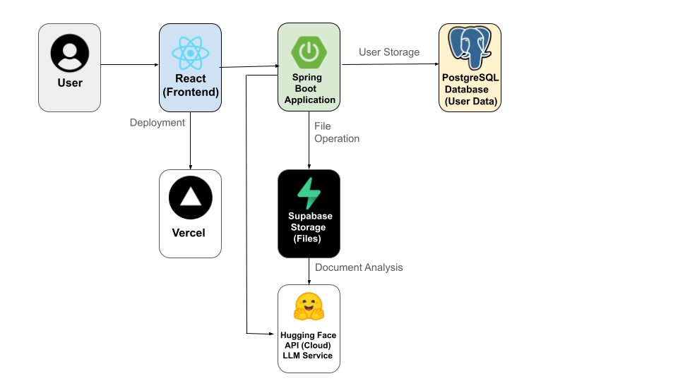

# VaultGuardian AI - Intelligent Secure Document Vault

## 🛡️ Overview

VaultGuardian AI is a comprehensive secure document management system that combines traditional security measures with AI-powered content analysis. It automatically scans, analyzes, and monitors documents for security risks, policy violations, and sensitive content using cloud-based AI services.

## 🚀 Key Features

### Core Security Features
- **🔍 Malware/PII Scanning**: Pre-upload security scanning
- **🤖 AI Content Analysis**: AI-powered document analysis using Hugging Face
- **📋 Policy Enforcement**: Automatic policy violation detection
- **🔐 Encrypted Storage**: Server-side encryption in Supabase Storage
- **👥 Access Control**: Role-based user permissions
- **📊 Audit Logging**: Comprehensive activity tracking

### AI Enhancement Features
- **📝 Risk Summarization**: User-friendly risk explanations
- **🎯 Smart Categorization**: Automatic document classification
- **⚡ Real-time Analysis**: Instant security assessment
- **🔗 Pattern Detection**: Advanced regex and AI-based content scanning

## 🏗️ Production Architecture



### Technology Stack

#### **Frontend**
- **React 18** with Tailwind CSS
- **Deployed on**: Vercel
- **Features**: Real-time updates, responsive design, secure authentication

#### **Backend**
- **Spring Boot 3.2** with Java 17
- **Deployed on**: Railway/Render
- **Security**: JWT authentication, BCrypt encryption, Spring Security
- **APIs**: RESTful endpoints with comprehensive validation

#### **Database & Storage**
- **Database**: PostgreSQL (Supabase)
- **File Storage**: Supabase Storage with encryption
- **Cache**: Redis for session management

#### **AI & Analytics**
- **LLM Service**: Hugging Face Inference API
- **Content Analysis**: Advanced pattern matching + AI
- **Fallback**: Regex-based analysis for reliability

#### **Development**
- **Local Development**: Docker & Docker Compose
- **Containerization**: Multi-stage Docker builds
- **CI/CD**: GitHub Actions (optional)

#### **🐞 Known Issues & Fixes**
- **1.** Token Expiry and Refresh Redirect
Problem: When the page is refreshed, the app sometimes redirects to the login page even though the user is still logged in.

Cause: The JWT token isn't validated quickly enough before protected routes are loaded, causing unauthorized errors.

Fix (Planned): Implement a loading check in AuthProvider to delay component rendering until token validation is complete.

- **2.** File Upload Sync Across Devices
Problem: Files uploaded on one device don't appear when logged into the same account from another device.

Cause: The uploaded file’s metadata may be tied to a session-specific token or upload state wasn't committed correctly.

Fix (Planned): Ensure uploaded file metadata is properly stored in Supabase and always fetched based on the authenticated user's ID.

- **3.** Page Refresh Breaks Auth State (401 Errors)
Problem: Refreshing causes temporary loss of token from localStorage/session, resulting in 401 errors on secure routes.

Fix: Wrap the entire app in an AuthContext that checks and restores token validity before rendering any protected pages.

## 🚀 Quick Start

### Option 1: Production Demo (Recommended)
Visit the live demo: **[VaultGuardian AI Demo](https://vaultguardian.vercel.app)** *(Coming Soon)*

### Option 2: Local Development

#### Prerequisites
- Java 17+
- Node.js 18+
- Docker & Docker Compose
- 4GB+ RAM

#### Setup

1. **Clone Repository**
```bash
git clone https://github.com/your-username/vaultguardian-ai
cd vaultguardian-ai
```

2. **Environment Configuration**
Create `.env` file:
```env
# Hugging Face API
HUGGINGFACE_API_TOKEN=your_hf_token_here
LLM_PROVIDER=huggingface

# Database (Local Development)
POSTGRES_PASSWORD=secure_password_here

# Security
JWT_SECRET=your_very_long_and_secure_jwt_secret_key_here

# AWS S3 (Local Development Only)
AWS_ACCESS_KEY_ID=your_access_key_here
AWS_SECRET_ACCESS_KEY=your_secret_key_here
S3_BUCKET_NAME=vaultguardian-secure-docs
```

3. **Start Development Environment**
```bash
# Start all services
docker-compose up --build

# In another terminal, start frontend
cd frontend
npm install
npm start
```

4. **Access Application**
- **Frontend**: http://localhost:3000
- **Backend API**: http://localhost:8080
- **Database**: localhost:5432

## 🔧 Configuration

### Hugging Face Setup
1. Create account at [Hugging Face](https://huggingface.co)
2. Generate API token in Settings > Access Tokens
3. Add token to `.env` file
4. Free tier: 1,000 requests/month

### Database Initialization
Default admin account:
- **Username**: `admin`
- **Password**: `admin123`

## 📊 API Documentation

### Authentication Endpoints
```
POST /api/auth/login       - User login
POST /api/auth/register    - User registration
GET  /api/auth/me          - Get current user
```

### Document Management
```
POST   /api/documents/upload              - Upload document
GET    /api/documents                     - List user documents
GET    /api/documents/{id}                - Get document details
GET    /api/documents/{id}/download       - Download document
DELETE /api/documents/{id}                - Delete document
POST   /api/documents/{id}/quarantine     - Quarantine document
```

### Analytics
```
GET /api/documents/analytics/dashboard - Dashboard statistics
```

## 🛡️ Security Features

### Document Analysis Pipeline
1. **File Upload**: Secure multipart upload with validation
2. **Malware Scanning**: Pre-processing security checks
3. **Content Extraction**: Text extraction using Apache Tika
4. **AI Analysis**: Hugging Face API + regex pattern matching
5. **Policy Enforcement**: Rule-based security validation
6. **Risk Assessment**: Automated risk level calculation
7. **Storage**: Encrypted storage with access logging

### Security Measures
- **JWT Authentication**: Stateless, secure token-based auth
- **Role-Based Access Control**: USER, ADMIN, SECURITY_OFFICER roles
- **Rate Limiting**: API abuse prevention
- **File Type Validation**: Whitelist-based file type checking
- **Size Limits**: 50MB maximum file size
- **Encryption**: All files encrypted at rest
- **Audit Logging**: Comprehensive activity tracking

## 🔍 Monitoring & Health Checks

### Health Endpoints
- **Application**: `GET /actuator/health`
- **Database**: Automatic connectivity monitoring
- **AI Service**: Hugging Face API status checking

### Logging
```properties
logging.level.com.vaultguardian=INFO
logging.level.org.springframework.security=WARN
```

## 🚨 Troubleshooting

### Common Issues

1. **Upload Failures (401 Unauthorized)**
   - Ensure you're logged in with valid JWT token
   - Check browser developer tools for authentication errors

2. **AI Analysis Errors**
   - Verify Hugging Face API token is valid
   - Check if free tier quota (1000 requests) is exceeded
   - System falls back to regex-only analysis

3. **Database Connection Issues**
   ```bash
   docker-compose logs vaultguardian-db
   docker-compose restart vaultguardian-db
   ```

4. **File Upload Size Errors**
   - Maximum file size: 50MB
   - Supported formats: PDF, DOCX, XLSX, TXT

## 🚀 Deployment Guide

### Production Deployment

#### Frontend (Vercel)
1. Connect GitHub repository to Vercel
2. Set environment variables in Vercel dashboard
3. Deploy automatically on push to main branch

#### Backend (Railway/Render)
1. Connect GitHub repository
2. Configure environment variables:
   ```env
   DATABASE_URL=your_supabase_db_url
   SUPABASE_URL=https://your-project.supabase.co
   SUPABASE_ANON_KEY=your_supabase_anon_key
   HUGGINGFACE_API_TOKEN=your_hf_token
   JWT_SECRET=your_production_jwt_secret
   ```
3. Deploy with automatic builds

#### Database (Supabase)
1. Create new Supabase project
2. Run `init-db.sql` in SQL editor
3. Configure connection string

## 📈 Performance & Scaling

### Performance Optimizations
- **Database**: Connection pooling, indexing
- **Caching**: Redis for session management
- **CDN**: Vercel Edge Network for frontend
- **API**: Rate limiting and request optimization

### Scaling Considerations
- **Horizontal Scaling**: Stateless backend design
- **Database**: Read replicas for high load
- **File Storage**: Distributed storage with Supabase
- **AI Processing**: Queue-based processing for high volume

## 🔐 Security Best Practices

### Development
- Never commit real credentials to version control
- Use environment variables for all secrets
- Regular dependency updates
- Code security scanning

### Production
- HTTPS enforcement
- CORS configuration
- Database encryption
- Regular security audits
- Automated backup procedures

## 📝 License

This project is licensed under the MIT License - see the [LICENSE](LICENSE) file for details.

## 🤝 Contributing

1. Fork the repository
2. Create a feature branch (`git checkout -b feature/amazing-feature`)
3. Commit your changes (`git commit -m 'Add amazing feature'`)
4. Push to the branch (`git push origin feature/amazing-feature`)
5. Open a Pull Request

## 📞 Support & Contact

- **Issues**: [GitHub Issues](https://github.com/your-username/vaultguardian-ai/issues)
- **Documentation**: Check troubleshooting section above
- **Email**: anishkajan2005@gmail.com

---

## 🎯 Project Status

- ✅ **Core Features**: Document upload, AI analysis, user management
- ✅ **Security**: JWT auth, role-based access, encryption
- ✅ **AI Integration**: Hugging Face API with fallback analysis
- ✅ **Deployment**: Production-ready cloud architecture
- 🚧 **Upcoming**: Advanced analytics, mobile app, enterprise features

**VaultGuardian AI** - Protecting your documents with intelligent security 🛡️
