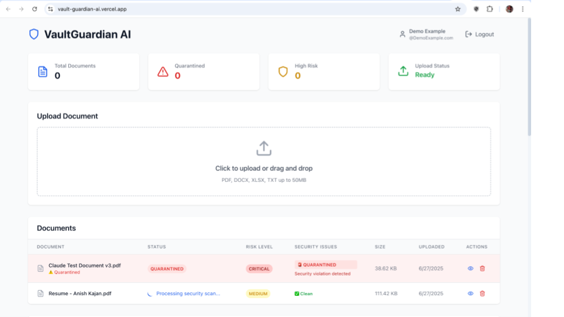

# VaultGuardian AI - Intelligent Secure Document Vault

## 🛡️ Overview

VaultGuardian AI is a comprehensive secure document management system that combines traditional security measures with AI-powered content analysis. It automatically scans, analyzes, and monitors documents for security risks, policy violations, and sensitive content using cloud-based AI services.

## 🚀 Key Features

### Core Security Features
- **🔍 Malware/PII Scanning**: Pre-upload security scanning with pattern detection
- **🤖 AI Content Analysis**: AI-powered document analysis using Hugging Face
- **📋 Policy Enforcement**: Automatic policy violation detection
- **🔐 Encrypted Storage**: Server-side encryption in Azure Blob
- **👥 Access Control**: Role-based user permissions (USER, ADMIN, SECURITY_OFFICER)
- **📊 Audit Logging**: Comprehensive activity tracking

### AI Enhancement Features
- **📝 Risk Summarization**: User-friendly risk explanations
- **🎯 Smart Categorization**: Automatic document classification
- **⚡ Real-time Analysis**: Instant security assessment
- **🔗 Pattern Detection**: Advanced regex and AI-based content scanning

## 🏗️ Production Architecture

### Technology Stack


### UI Display
Login Page:


Sign Up:


WebPage (with a Medium and Critical upload):



#### **Frontend**
- **React 18** with Tailwind CSS
- **Deployed on**: Vercel
- **Features**: Real-time updates, responsive design, JWT authentication
- **Libraries**: Lucide React (icons), Custom Snackbar notifications

#### **Backend**
- **Spring Boot 3.2** with Java 17
- **Deployed on**: Render
- **Security**: JWT authentication, BCrypt encryption, Spring Security
- **APIs**: RESTful endpoints with comprehensive validation

#### **Database & Storage**
- **Database**: PostgreSQL (Supabase)
- **File Storage**: Azure BLOB with server-side encryption
- **Connection Pooling**: HikariCP optimized for cloud deployment

#### **AI & Analytics**
- **LLM Service**: Hugging Face Inference API
- **Content Analysis**: Advanced pattern matching + AI
- **Fallback**: Regex-based analysis for reliability
- **Text Extraction**: Apache Tika

## 🚀 Quick Start

### Option 1: Production Deployment (Recommended)
Note: Render Free tier is used for backend, this causes a delay when starting the backend 15 minutes after the app has not been in use.

#### Frontend (Vercel)
1. Fork this repository
2. Connect to Vercel
3. Set environment variable:
   ```env
   REACT_APP_API_URL=https://your-backend-url.onrender.com/api
   ```
4. Deploy

#### Backend (Render)
1. Connect GitHub repository
2. Configure environment variables:
   ```env
   # Database
   DATABASE_URL=postgresql://your-supabase-url
   
   # Storage
   STORAGE_PROVIDER=azure
   AZURE_STORAGE_ACCOUNT_NAME=vaultguardian
   AZURE_STORAGE_ACCOUNT_KEY=your-azure-key
   AZURE_STORAGE_CONTAINER_NAME=vaultguardian-ai
   AZURE_STORAGE_ENDPOINT=https://vaultguardian.blob.core.windows.net
   
   # AI
   HUGGINGFACE_API_TOKEN=your-hf-token
   LLM_PROVIDER=huggingface
   
   # Security
   JWT_SECRET=your-secure-jwt-secret
   
   # Spring
   SPRING_PROFILES_ACTIVE=production
   PORT=8080
   ```
3. Build Command: `./mvnw clean install -DskipTests`
4. Start Command: `java -Dserver.port=$PORT -jar target/vaultguardian-ai.jar`

### Option 2: Local Development

#### Prerequisites
- Java 17+
- Node.js 18+
- Docker & Docker Compose
- Azure Account (for BLOB)
- Hugging Face Account

#### Setup

1. **Clone Repository**
```bash
git clone https://github.com/your-username/vaultguardian-ai
cd vaultguardian-ai
```

2. **Backend Setup**
```bash
# Create application-local.properties
cp src/main/resources/application.properties src/main/resources/application-local.properties

# Run with local profile
./mvnw spring-boot:run -Dspring.profiles.active=local
```

3. **Frontend Setup**
```bash
cd frontend
npm install
npm start
```

4. **Docker Setup (Alternative)**
```bash
docker-compose up --build
```

## 📊 API Documentation

### Authentication Endpoints
```
POST /api/auth/login       - User login
POST /api/auth/register    - User registration
GET  /api/auth/me          - Get current user
```

### Document Management
```
POST   /api/documents/upload              - Upload document
GET    /api/documents                     - List user documents
GET    /api/documents/{id}                - Get document details
GET    /api/documents/{id}/download       - Download document
DELETE /api/documents/{id}                - Delete document
POST   /api/documents/{id}/quarantine     - Quarantine document (Security Officer only)
```

### Analytics & Health
```
GET /api/documents/analytics/dashboard - Dashboard statistics
GET /api/health                       - Health check endpoint
```

## 🛡️ Security Features

### Document Analysis Pipeline
1. **File Upload**: Secure multipart upload with validation
2. **SHA-256 Hashing**: Duplicate detection
3. **Malware Scanning**: Pattern-based security checks
4. **Content Extraction**: Text extraction using Apache Tika
5. **AI Analysis**: Hugging Face API for advanced content analysis
6. **Policy Enforcement**: Rule-based security validation
7. **Risk Assessment**: Automated risk level calculation (LOW/MEDIUM/HIGH/CRITICAL)
8. **Storage**: Encrypted storage in Azure Blob

### Security Measures
- **JWT Authentication**: Stateless, secure token-based auth
- **Role-Based Access Control**: USER, ADMIN, SECURITY_OFFICER roles
- **CORS Configuration**: Controlled cross-origin access
- **File Type Validation**: PDF, DOCX, XLSX, TXT only
- **Size Limits**: 50MB maximum file size
- **Encryption**: AES-256 encryption at rest
- **Audit Logging**: Comprehensive activity tracking

## 🔧 Configuration

### Azure Blob Storage Setup
1. Create a Storage Account named `vaultguardian` in the Azure Portal
2. Inside the storage account, create a private Blob Container named `vaultguardian-ai`
3. Navigate to the "Access keys" section and copy the `Account Name` and `Key1` for authentication
4. (Optional) Set up a Lifecycle Management rule to automatically delete blobs older than 5 days
5. (Recommended) Configure a Budget in Azure Cost Management to control spending

### Hugging Face Setup
1. Create account at [Hugging Face](https://huggingface.co)
2. Generate API token in Settings > Access Tokens
3. Add token to environment variables
4. Free tier: 1,000 requests/month

### Database Schema
The application uses JPA/Hibernate for automatic schema generation. Key entities:
- `User`: Authentication and profile data
- `Document`: File metadata and analysis results
- `Roles`: USER, ADMIN, SECURITY_OFFICER
- Audit timestamps on all entities

## 🚨 Troubleshooting

### Common Issues

1. **Token Refresh Issues**
   - Fixed: AuthProvider now properly validates tokens on page refresh
   - Solution implemented in `AuthComponents.js`

2. **File Upload Errors**
   - Ensure `STORAGE_PROVIDER=s3` is set in environment
   - Verify Azure credentials are correct
   - Check S3 bucket permissions

3. **Render Cold Starts**
   - First request takes 30-60 seconds
   - Frontend implements retry mechanism
   - Consider upgrading to paid tier for always-on

4. **Database Connection Pool**
   - Optimized for free-tier limits (5 connections)
   - HikariCP configuration in properties

## 📈 Performance & Scaling

### Current Optimizations
- **Async Processing**: Document analysis runs asynchronously
- **Connection Pooling**: Optimized for cloud databases
- **CDN Distribution**: Frontend served via Vercel's edge network
- **Stateless Design**: Backend can scale horizontally

### Production Considerations
- **Free Tier Limits**:
  - Render: Spins down after 15 minutes
  - Supabase: 500MB storage, 2GB bandwidth
  - Hugging Face: 1,000 API calls/month
  - Azure Blob: Pay-as-you-go

## 🔐 Security Best Practices

### Environment Variables
- Never commit `.env` files
- Use strong JWT secrets (minimum 32 characters)
- Rotate credentials regularly
- Use different credentials for each environment

### Production Security
- HTTPS enforced on all endpoints
- CORS restricted to specific origins
- Rate limiting recommended
- Regular security audits
- Automated backups for database

## 📝 License

This project is licensed under the MIT License - see the [LICENSE](LICENSE) file for details.

## 🤝 Contributing

1. Fork the repository
2. Create a feature branch (`git checkout -b feature/amazing-feature`)
3. Commit your changes (`git commit -m 'Add amazing feature'`)
4. Push to the branch (`git push origin feature/amazing-feature`)
5. Open a Pull Request

## 🐛 Known Issues

1. **Admin Login**: Use DataInitialization.java to ensure admin user exists
2. **Empty Document List**: New users see proper empty state
3. **File Processing Status**: Auto-refreshes every 3 seconds during processing

## 📞 Support & Contact

- **Issues**: [GitHub Issues](https://github.com/your-username/vaultguardian-ai/issues)
- **Documentation**: See Architecture Guide in `/docs`
- **Email**: anishkajan2005@gmail.com

---

## 🎯 Project Status

- ✅ **Core Features**: Document upload, AI analysis, user management
- ✅ **Security**: JWT auth, role-based access, encryption
- ✅ **AI Integration**: Hugging Face API with fallback analysis
- ✅ **Cloud Deployment**: Production-ready on Vercel + Render + Azure Blob
- ✅ **Real-time Updates**: Async processing with status updates
- 🚧 **Upcoming**: WebSocket notifications, advanced analytics, mobile app

**VaultGuardian AI** - Protecting your documents with intelligent security 🛡️